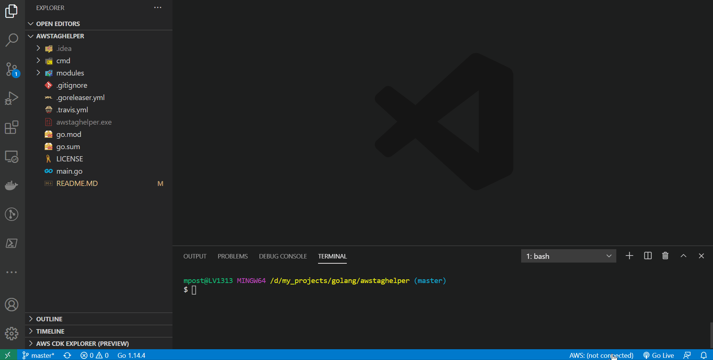

# AWSTagHelper

## Painless AWS tagging

Tags are critical to managing AWS resources at scale. Awstaghelper provides a command line tool to ease adding and managing tags to and from CSV files across the wide range of AWS resources.

## Table of Contents

* [Usage Example](#usage-example)
* [Installing](#installing)
* [Getting Started](#getting-started)
  * [Ec2](#ec2)
  * [Ec2 SecurityGroup](#ec2sg)
  * [Rds](#rds)
  * [Lambda](#lambda)
  * [S3](#s3)
  * [ElastiCache](#elasticache)
  * [Redshift](#redshift)
  * [ElasticSearch](#elasticsearch)
  * [CloudWatch Logs](#cloudwatchl-ogs)
  * [CloudWatch Alarm](#cloudwatchal-arm)
  * [Config](#config-rule)
  * [CloudFront Distribution](#cloudfront-distribution)
  * [ElbV2](#elbv2)
  * [Kinesis Stream](#kinesis-stream)
  * [Kinesis Firehose](#kinesis-firehose)
  * [Iam User](#iam-user)
  * [Iam Role](#iam-role)
  * [Elastic Beanstalk](#elastic-beanstalk)
  * [ECR](#ecr)
  * [AutoScaling groups](#autoscaling-groups)
  * [EBS Volumes](#ebs-volumes)
* [Global parameters](#global-parameters)
* [Contributing](#contributing)
* [License](#license)

## Usage example

## Installing

Download the latest binary from [releases](https://github.com/mpostument/awstaghelper/releases)

## Getting Started

### Ec2

#### Get ec2 tags

Get list of ec2 with required tags - `awstaghelper ec2 get-ec2-tags`  
Example:
 `awstaghelper ec2 get-ec2-tags --filename ec2Tag.csv --tags Name,Owner --profile main`

#### Tag ec2

Read csv and tag ec2 - `awstaghelper ec2 tag-ec2`  
Example:
 `awstaghelper ec2 tag-ec2 --filename ec2Tag.csv --profile main`  

#### Get security group tags

Get list of SGs with required tags - `awstaghelper ec2 get-sg-tags`  
Example:
 `awstaghelper ec2 get-sg-tags --filename sgTag.csv --tags Name,Owner --profile main`

#### Tag security group

Read csv and tag ec2 - `awstaghelper ec2 tag-sg`  
Example:
 `awstaghelper ec2 tag-sg --filename sgTag.csv --profile main`  

### Rds

#### Get rds tags

Get list of rds with required tags - `awstaghelper rds get-rds-tags`  
Example:
 `awstaghelper rds get-rds-tags --filename rdsTag.csv --tags Name,Owner --profile main`

#### Tag rds

Read csv and tag rds - `awstaghelper rds tag-rds`  
Example:
 `awstaghelper rds tag-rds --filename rdsTag.csv --profile main`  

### Lambda

#### Get lambda tags

Get list of lambda with required tags - `awstaghelper lambda get-lambda-tags`  
Example:
 `awstaghelper lambda get-lambda-tags --filename lambdaTag.csv --tags Name,Owner --profile main`

#### Tag lambda

Read csv and tag lambda - `awstaghelper lambda tag-lambda`  
Example:
 `awstaghelper lambda tag-lambda --filename lambdaTag.csv --profile main`  

### S3

#### Get s3 tags

Get list of s3 with required tags - `awstaghelper s3 get-s3-tags`  
Example:
 `awstaghelper s3 get-s3-tags --filename s3Tag.csv --tags Name,Owner --profile main`

#### Tag s3

Read csv and tag s3 - `awstaghelper s3 tag-s3`  
Example:
 `awstaghelper s3 tag-s3 --filename ec2Tag.csv --profile main`  

### Elasticache

#### Get elasticache tags

Get list of s3 with required tags - `awstaghelper elasticache get-elasticache-tags`  
Example:
`awstaghelper elasticache get-elasticache-tags --filename elasticacheTag.csv --tags Name,Owner --profile main`

#### Tag elasticache

Read csv and tag s3 - `awstaghelper elasticache tag-elasticache`  
Example:
`awstaghelper elasticache tag-elasticache --filename elasticacheTag.csv --profile main`  

### Redshift

#### Get redshift tags

Get list of redshift with required tags - `awstaghelper redshift get-redshift-tags`  
Example:
`awstaghelper redshift get-redshift-tags --filename redshiftTag.csv --tags Name,Owner --profile main`

#### Tag redshift

Read csv and tag redshift - `awstaghelper redshift tag-redshift`  
Example:
`awstaghelper redshift tag-redshift --filename redshiftTag.csv --profile main`  

### ElasticSearch

#### Get elasticsearch tags

Get list of elasticsearch with required tags - `awstaghelper elasticsearch get-elasticsearch-tags`  
Example:
`awstaghelper elasticsearch get-elasticsearch-tags --filename elasticsearchTag.csv --tags Name,Owner --profile main`

#### Tag elasticsearch

Read csv and tag elasticsearch - `awstaghelper elasticsearch tag-elasticsearch`  
Example:
`awstaghelper elasticsearch tag-elasticsearch --filename elasticsearchTag.csv --profile main`  

### CloudWatch Logs

#### Get cloudwatch logs tags

Get list of cloudwatch logs with required tags - `awstaghelper cloudwatch get-cwlogs-tags`  
Example:
`awstaghelper cloudwatch get-cwlogs-tags --filename cwlTag.csv --tags Name,Owner --profile main`

#### Tag cloudwatch logs

Read csv and tag cloudwatch logs - `awstaghelper cloudwatch tag-cwlogs`  
Example:
`awstaghelper cloudwatch tag-cwlogs --filename cwlTag.csv --profile main`  

### CloudWatch Alarm

#### Get cloudwatch alarm tags

Get list of cloudwatch alarms with required tags - `awstaghelper cloudwatch get-cwalarm-tags`  
Example:
`awstaghelper cloudwatch get-cwalarm-tags --filename cwaTag.csv --tags Name,Owner --profile main`

#### Tag cloudwatch alarm

Read csv and tag cloudwatch alarm - `awstaghelper cloudwatch tag-cwalarm`  
Example:
`awstaghelper cloudwatch tag-cwalarms --filename cwaTag.csv --profile main`  

### Config Rule

#### Get config rule tags

Get list of config rules with required tags - `awstaghelper config get-rule-tags`  
Example:
`awstaghelper config get-rule-tags --filename ruleTag.csv --tags Name,Owner --profile main`

#### Tag config rule

Read csv and tag config rules - `awstaghelper config tag-config`  
Example:
`awstaghelper config tag-config --filename configTag.csv --profile main`  

### CloudFront distribution

#### Get distribution tags

Get list of distribution with required tags - `awstaghelper cloudfront get-distribution-tags`  
Example:
`awstaghelper cloudfront get-distribution-tags --filename distributionTag.csv --tags Name,Owner --profile main`

#### Tag distribution

Read csv and tag distribution - `awstaghelper cloudfront tag-distribution`  
Example:
`awstaghelper cloudfront tag-distribution --filename distributionTag.csv --profile main`  

### ElbV2

#### Get ElbV2 tags

Get list of elbv2 (appliction, network loadbalancer) with required tags - `awstaghelper elb get-elbv2-tags`  
Example:
`awstaghelper elb get-elbv2-tags --filename elbv2Tag.csv --tags Name,Owner --profile main`

#### Tag ElbV2

Read csv and tag elbv2 (appliction, network loadbalancer) - `awstaghelper elb tag-elbv2`  
Example:
`awstaghelper elb tag-elbv2 --filename elbv2Tag.csv --profile main`  

### Kinesis stream

#### Get stream tags

Get list of kinesis with required tags - `awstaghelper kinesis get-stream-tags`  
Example:
`awstaghelper kinesis get-stream-tags --filename kinesisTag.csv --tags Name,Owner --profile main`

#### Tag streams

Read csv and tag kinesis - `awstaghelper kinesis tag-stream`  
Example:
`awstaghelper kinesis tag-stream --filename kinesisTag.csv --profile main`  

### Kinesis firehose

#### Get firehose tags

Get list of kinesis firehose with required tags - `awstaghelper kinesis get-firehose-tags`  
Example:
`awstaghelper kinesis get-firehose-tags --filename firehoseTag.csv --tags Name,Owner --profile main`

#### Tag firehose

Read csv and tag kinesis firehose - `awstaghelper kinesis tag-firehose`  
Example:
`awstaghelper kinesis tag-firehose --filename firehoseTag.csv --profile main`  

### Iam User

#### Get user tags

Get list of iam user with required tags - `awstaghelper iam get-user-tags`  
Example:
`awstaghelper iam get-user-tags --filename userTag.csv --tags Name,Owner --profile main`

#### Tag user

Read csv and tag iam user - `awstaghelper iam tag-user`  
Example:
`awstaghelper iam tag-user --filename userTag.csv --profile main`  

### Iam Role

#### Get role tags

Get list of iam role with required tags - `awstaghelper iam get-role-tags`  
Example:
`awstaghelper iam get-role-tags --filename roleTag.csv --tags Name,Owner --profile main`

#### Tag role

Read csv and tag iam role - `awstaghelper iam tag-role`  
Example:
`awstaghelper iam tag-role --filename roleTag.csv --profile main`  

### Elastic Beanstalk

#### Get elastic beanstalk tags

Get list of elastic beanstalk environnement with required tags - `awstaghelper eb get-eb-tags`  
Example:
`awstaghelper eb get-eb-tags --filename ebTag.csv --tags Name,Owner --profile main`

#### Tag elastic beanstalk environnement

Read csv and tag elastic beanstalk environnement - `awstaghelper eb tag-eb`  
Example:
`awstaghelper eb tag-eb --filename ebTag.csv --profile main`  

### ECR

#### Get ecr tags

Get list of ecr with required tags - `awstaghelper ecr get-repository-tags`  
Example:
`awstaghelper ecr get-repository-tags --filename ecrTag.csv --tags Name,Owner --profile main`

#### Tag ecr

Read csv and tag ecr - `awstaghelper ecr tag-repository`  
Example:
`awstaghelper ecr tag-repository --filename ecrTag.csv --profile main`  

### AutoScaling groups

#### Get ASG tags

Get list of ASGs with required tags - `awstaghelper asg get-asg-tags`

Example:
`awstaghelper asg get-asg-tags --filename asgTags.csv --tags Name,Owner --profile main`

#### Tag ASGs

Read csv and tag ASGs - `awstaghelper asg tag-asg`

Example:
`awstaghelper asg tag-asg --filename asgTags.csv --profile main`

### EBS Volumes

#### Get EBS volume tags

Get list of EBS volumes with required tags - `awstaghelper ebs get-ebs-tags`

Example:
`awstaghelper ebs get-ebs-tags --filename ebsTags.csv --tags Name,Owner --profile main`

#### Tag EBS volumes

Read csv and tag EBS volumes - `awstaghelper ebs tag-ebs`

Example:
`awstaghelper ebs tag-ebs --filename ebsTags.csv --profile main`

## Global parameters

`filename` - path where to write or read data. Supported by every option. Default `awsTags.csv`  
`tags` - list of tags to read. Supported only with `get-tags` option. Default `Name,Environment`  
`region` - aws region to use. Supported by every option. Default `us-east-1`  
`profile` - aws profile to use. Supported by every option. Default `default`  

## Contributing

1. Fork it
2. Download your fork to your PC ( `git clone https://github.com/your_username/awstaghelper && cd awstaghelper` )
3. Create your feature branch ( `git checkout -b my-new-feature` )
4. Make changes and add them ( `git add .` )
5. Commit your changes ( `git commit -m 'Add some feature'` )
6. Push to the branch ( `git push origin my-new-feature` )
7. Create new pull request

## License

Awstaghelper is released under the Apache 2.0 license. See [LICENSE.txt](https://github.com/mpostument/awstaghelper/blob/master/LICENSE)
